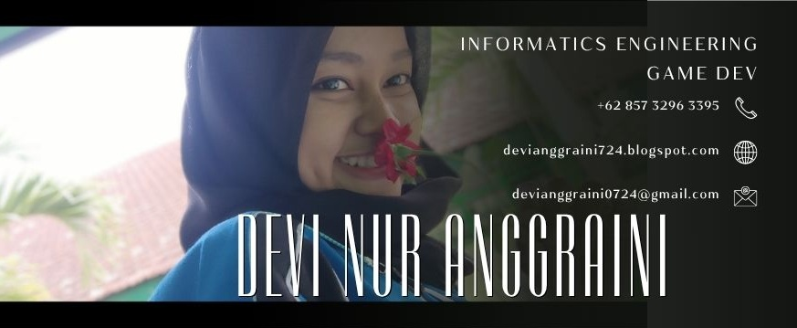

  

  # 💫 Devi Nur Anggraini
  **Data Analis | Mobile & Game Developer | UI/UX & IoT Enthusiast**

  
  
  
  

---

### ⚡ Tentang Saya

Hai! 👋 Saya adalah lulusan Teknik Informatika yang memiliki minat dibidang teknologi dan seni. Sebagai lulusan Teknik Informatika, saya tidak hanya mendesain user interface yang estetis dan fungsional, tetapi juga menciptakan pengalaman yang bermakna.

Dengan keahlian dalam public speaking, saya terbiasa berinteraksi dengan orang lain dalam berbagai momen.

- 🎓 **Pendidikan:** S1 Teknik Informatika - STIKI Malang
- 💡 **Fokus Spesialisasi:** Mobile Development (Kotlin/Android), Game Development, & UI/UX Design
- 🏆 **Prestasi Utama:** 
  - Finalis 10 Besar *Project Manager Challenge (PMC) 2024* (PMI-Indonesia)
  - Pemegang **2 Hak Kekayaan Intelektual (HAKI)** Terdaftar
- 🎙️ **Keahlian Pendukung:** Public Speaking, Master of Ceremony (MC), dan Project Management

---

### 🚀 Hak Kekayaan Intelektual (HAKI) & Proyek Utama

| Proyek | Deskripsi | Tech Stack | Status |
| :--- | :--- | :--- | :--- |
| 🛡️ **IoT Guard** | Aplikasi Mobile Sistem Keamanan Berbasis IoT & Monitoring Real-time | Kotlin, IoT API, Firebase | **Terdaftar HAKI** (EC002024261588)[cite: 1] |
| 🚪 **Secure Gate System** | Aplikasi Mobile Akses Gerbang Otomatis & Autentikasi Hardware | Kotlin, Hardware Integration | **Terdaftar HAKI** (EC002025135577)[cite: 1] |
| 🌐 **Personal Portfolio** | Website Portofolio Interaktif & Responsif Single-Page | HTML5, Tailwind CSS | **Live Website** |

---

### 🛠️ Keahlian & Teknologi

#### 📱 Mobile & Game Development
   

#### 💻 Web Development & Database
  

#### 🎨 Desain & UI/UX
 

#### ⚙️ Tools & Produktivitas
   

---

### 📊 Statistik GitHub

  
  
  

---

  
<i>"Kreativitas adalah kekuatan, dan setiap proyek adalah peluang untuk meninggalkan jejak yang tak terlupakan di dunia digital."</i>[cite: 1]

  
<b>Devi Nur Anggraini</b> © 2026

